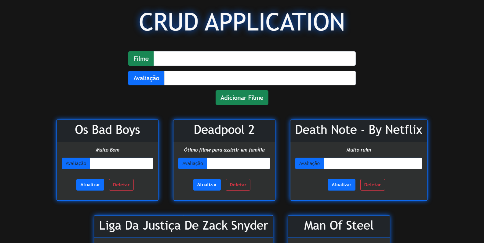

# CRUD com ReactJs + MySQL + NodeJS

Adicione filmes e as suas opiniões sobre os mesmos. Esta simples aplicação foi baseada no tutorial produzido por  [Pedro Henrique](https://github.com/machadop1407), disponibilizado em seu canal no [Youtube](https://cutt.ly/AR9HcQd).

    

<p align="center">
 <a href="#tecnologias">Tecnologias e Ferramentas Utilizadas</a> • 
 <a href="#requisitos">Requisitos</a> •
 <a href="#rodando">Rodando a Aplicação</a> •  
 <a href="#contribuicao">Contribuição</a>
</p>



<div id=#tecnologias>
</div>

### 🛠 Tecnologias e Ferramentas utilizadas

- [ReactJs](https://pt-br.reactjs.org/)
- [Node.Js](https://nodejs.org/en/)
- [MySQL](https://www.mysql.com/)
- [XAMPP](https://www.apachefriends.org/pt_br/index.html)
- [Express](https://expressjs.com/pt-br/)
- [Axios](https://axios-http.com/docs/intro)
- [Bootstrap](https://getbootstrap.com/)

<div id=#requisitos></div>

### :heavy_exclamation_mark: Pré-requisitos

Para rodar a aplicação em sua máquina, você precisa ter instalado o [Node.Js](https://nodejs.org/en/), [MySQL](https://www.mysql.com/) e um Editor de código de sua preferência. O arquivo para colocar as informações necessárias para a conexão com o seu banco de dados é ```server/index.js```, linha 7 à 12.

<div id=#rodando></div>

### :rocket: Rodando a Aplicação

```bash
# Clone este repositório
$ git clone https://github.com/DOGE-SENAI/crud-react-nodejs-mysql.git

# Acesse a pasta do projeto no terminal/cmd
$ cd crud-react-nodejs-mysql

### Server ###
# Vá para a pasta server
$ cd server

# Instale as dependências
$ npm install

# Execute a aplicação em modo de desenvolvimento
$ npm run devStart

### Client ###
# Vá para a pasta client
$ cd client

# Instale as dependências
$ npm install

# Execute a aplicação
$ npm start

# O servidor inciará na porta:3001 - acesse http://localhost:3001
# Não esqueça de iniciar o seu Banco de Dados.
```

<div id="#contribuicao"></div>

### 👥 Contributors

​	 👤 [Cauã Rodrigues](https://github.com/CauaRodrigues)

​	 👤 [Gabriel Mariano](https://github.com/Gabriel-MarianoJ)

​	 👤 [Gabriel dos Santos](https://github.com/GabrielGSF)

​	 👤 Joabe Oliveira

